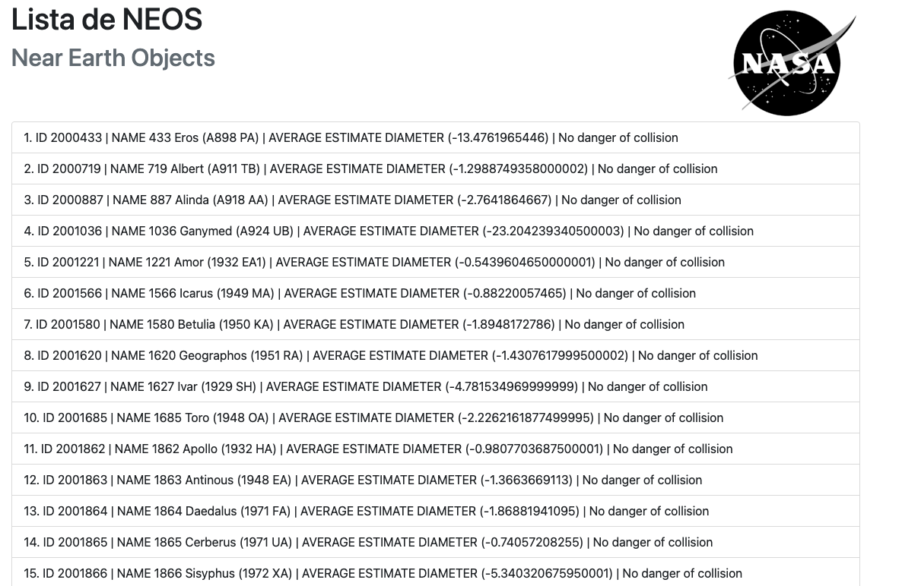

# neo-nasa
Consuming Rest API of NASA with simple method of JavaScript. 
## About Project
 >"Near-Earth Objects (NEOs) are comets and asteroids that have been nudged by the gravitational attraction of nearby planets into orbits that allow them to enter the Earth’s neighborhood" - (NASA)  

Then in this project i'll provide ( in the simples web page ) it for all of us.  

## Utilized Tech Stack
1. JavaScript
2. HTML
3. Bootstrap
4. Webpack
5. Babel

## Utilized Concepts  
1. Class 
2. Objects
3. Promises
4. Consume Rest API
5. Bases of JavaScript
6. Bases of HTML with DOM

## Steps to run the project:
1. run **npm i** to install all dependencies  
2. run **npx webpack --mode development** to generate files in the folder dist  
3. finally **run npm start**    

